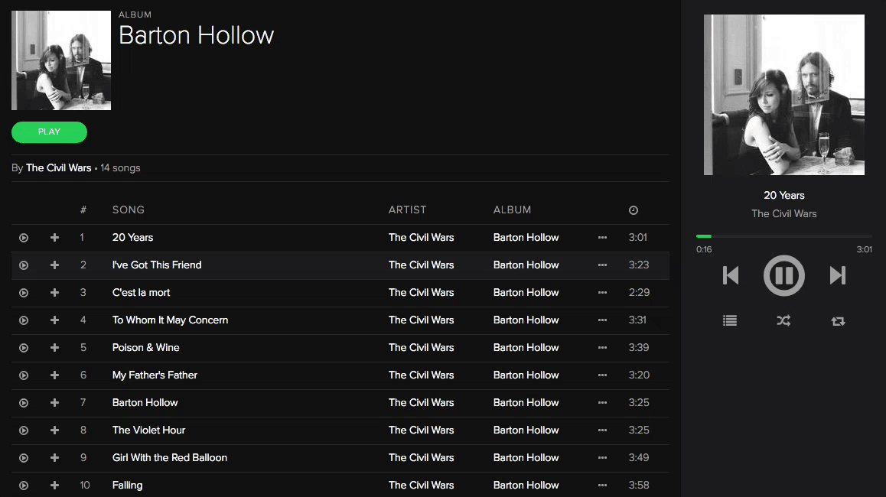

# Dropify

[Dropify][live]

[live]: http://www.dropifyapp.io

Dropify is a full-stack music-streaming web application inspired by the [Spotify Web Player][spotify]. It utilizes Ruby on Rails on the backend, a PostgreSQL database, and React.js with a Redux architectural framework on the frontend.

[spotify]: https://play.spotify.com

## Features & Implementation


### Artists, Albums and Songs

The main feature of Dropify is the ability for users to explore and discover new music. Using a PostgreSQL database with `artists`, `albums` and `songs` tables, linked to an Amazon Web Services (AWS) S3 cloud storage bucket, Dropify maintains a library of music ready for streaming at the touch of a button.

#### Modular Components

In order to keep the code base DRY and the UI consistent, Dropify utilizes several modular React components including a `<ContentCard/>` functional component that can render `artist`, `album` or `playlist` information based upon the props given.

```javascript
const ContentCard = ({ cardType, image, primaryContent, primaryLink, secondaryContent, secondaryLink }) => {
  if (cardType === "album") {
    secondaryContent = (<p className="secondary"><Link to={ secondaryLink } >{ secondaryContent }</Link></p>)
  }

  return (
    <div className={`content-card ${cardType}`}>
      <div className="content-card-image">
        
      </div>
      <div className="content-card-content">
        <p className="primary"><Link to={ primaryLink }>{ primaryContent }</Link></p>
        { secondaryContent }
      </div>
    </div>
  )
}
```

### Play Queue

Somewhat behind the scenes, Dropify relies on a `playQueue` object in the redux state that tracks the `currentSong` in play, as well as any `queuedSongs` that may be added individually or from albums or playlist.

#### NowPlaying

A sidebar `NowPlaying` component displays information about the `currentSong` and allows users to control the `playQueue` either by directly visiting the Play Queue page or clicking control buttons to shuffle or repeat the songs in the `playQueue`. To achieve this, the `playQueue` stores information about the `shuffledOrder` and unshuffled song `order` of the queue.

```javascript
const _defaultState = {
  currentSong: {
    song: {},
    playing: false,
    restart: false
  },
  queuedSongs: {
    songs: {},
    order: [],
    shuffledOrder: [],
  },
  shuffled: false,
  repeat: false
};
```

### Playlists

A key feature of Spotify is for users to be able to create, read, update and delete playlists. Dropify implements a `playlists` and `playlist_songs` association table to store information about the songs user's have added to their playlists.

#### Dropdown Menus

In order for users to be able to create, update and delete playlists as well as add and remove `songs` from playlists, Dropify implements dropdown menus that are conditionally rendered based upon a global `modalOpen` variable on the app's Redux state that stores the id of the currently open dropdown menu, if any.

```javascript
const Dropdown = ({ isOpen, children }) => {
  if (!isOpen) return null;
  return <div onClick={e => e.stopPropagation() }>{ children }</div>
};
```
As soon as a user clicks on an option from the dropdown menu, the menu is cleared by dispatching an action to the store. If the user decides not perform an action and clicks off of the menu, the menu is cleared from the global state and no longer rendered.



### Users & Follows

In order to allow users to be able to follow multiple types of models, such as other `users` and `playlists`, Dropify utilizes Rails polymorphic associations to implement a `follow` class and `follows` association table that stores information about the follow type.

```ruby
class User

  has_many :follows, as: :followable

  has_many :followers,
    through: :follows,
    source: :follower

  has_many :out_follows,
    foreign_key: :follower_id,
    class_name: 'Follow'

  has_many :followed_users,
    through: :out_follows,
    source: :followable,
    source_type: 'User'

  has_many :followed_playlists,
    through: :out_follows,
    source: :followable,
    source_type: 'Playlist'

end
```

The flexibility of this model allows for any model to be followable, including `artists` in the future.

## Future Directions for the Project

In addition to the features already implemented, I plan to continue work on this project. The next steps for Dropify are outlined below.

### Search

Searching artists, albums, songs, users and playlists is a standard feature of Spotify. I plan to utilize the Fuse.js library to implement a fuzzy search of these models that will populate a sidebar component, enabling users to find what they are looking for quickly.

### Genres / Radio

Using MP3 ID3 Tags, I have access to genre tags for songs. I plan to utilize genres to setup a radio feature that plays songs from various artists and albums with similar genres. Additionally, I plan to add a genres view to browse to allow users to search through playlists from various genres.

### Collection (Your Music)

Spotify enables users to save music from the global library into their own personal collection. Users can save songs, artists, albums and playlists into their music. While I have implemented the collection for playlists, I plan to add functionality for songs, artists and albums.

### Multiple Sessions / Responsive Design

In order to allow users to continue their session from the desktop to their mobile device, I plan to implement a sessions table to track user logins from different device types, allowing them to sign in on two devices. I also plan to implement responsive CSS styles for mobile screen widths.
